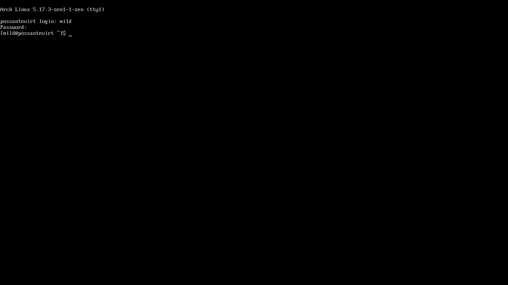
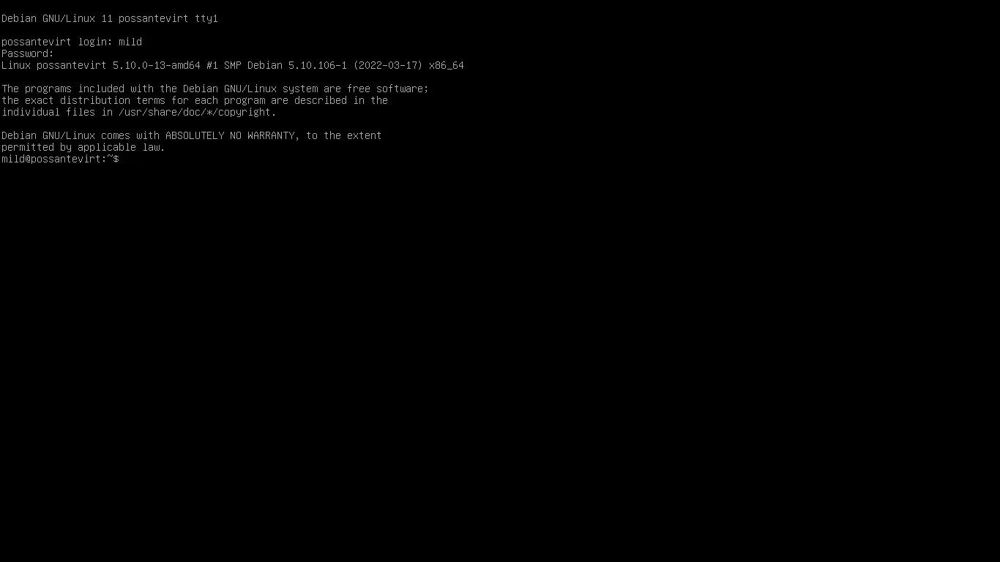
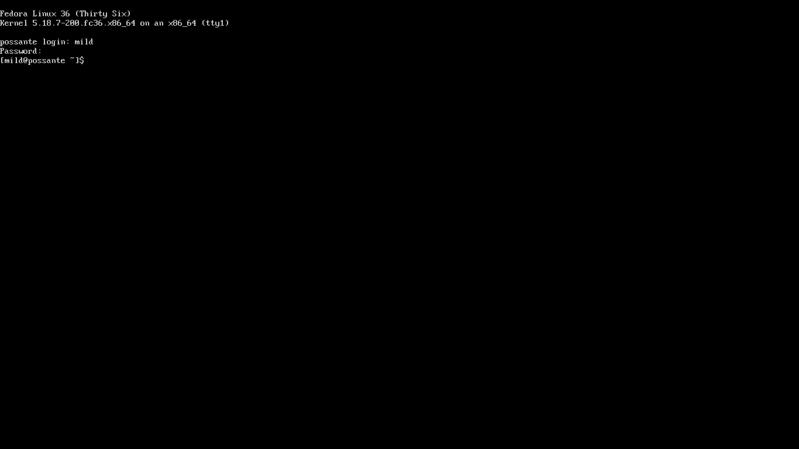

# MILD - Minimal Install Linux Desktop

MILD is a simple and straightforward text-mode installer that aims to install a "D.E."(Desktop Environment) with only the apps really necessary for each graphical environment. See below how to install in your favorite distro:

## Install Mild on ArchLinux

If you don't know how to install **Arch Linux** follow this [tutorial](installarchlinux.md)

After installing Arch Linux make sure you are connected to the internet after that click `Ctrl` + `Alt` + `F4` to proceed with the installation:

After you have entered your username and password, follow the next steps. If you want to compile **Mild** follow the "Make" option and if you just want to install and run Mild follow the "Non-make" option:

### Make

First update and install the following packages on your system:

	sudo pacman -Syu git curl base-devel --noconfirm && curl --proto '=https' --tlsv1.2 -sSf https://sh.rustup.rs | sh && source $HOME/.cargo/env

Now clone this repository with the command:

	git clone https://www.github.com/PEDROTUBER44/Mild.git

Now enter the Mild/ folder with the command:

	cd Mild/

Now give execute permission to the files "build.sh" and "install.sh" with the command:

	chmod +x install.sh build.sh

Now run the "build.sh" and "install.sh" files with the command:

	./build.sh && sudo ./install.sh

Now all that's left is to install your favorite desktop environment.

### Uninstall

To uninstall Mild and all its build dependencies type the following command. It will ask if you are sure you want to uninstall Rust so click 'Y' and hit 'enter':

	sudo pacman -Rsn curl git base-devel --noconfirm && sudo rm -r /usr/bin/mild && rustup self uninstall && cd .. && rm -rf Mild/

## Non-make

First update and install the following packages on your system:

	sudo pacman -Syu git --noconfirm

Now clone this repository with the command:

	git clone https://www.github.com/PEDROTUBER44/Mild.git

Now enter the Mild/ folder with the command:

	cd Mild/

Now give execute permission to the "install.sh" file with the command:

	chmod +x install.sh

Now run the "install.sh" files with the command:

	sudo ./install.sh

Now all that's left is to install your favorite desktop environment.

### Uninstall

To uninstall Mild and git type the following command:

	sudo pacman -Rsn git --noconfirm && sudo rm -r /usr/bin/mild && cd .. && rm -rf Mild/

## ArchLinux Desktops Environments

Now choose the graphical environment that will be installed on your PC:

### Lxde

	mild --install-arch-lxde

### Lxqt

	mild --install-arch-lxqt

### Xfce4

	mild --install-arch-xfce

### Gnome

	mild --install-arch-gnome

### Mate

	mild --install-arch-mate

### Kde plasma

	mild --install-arch-kdeplasma

### Cinnamon

	mild --install-arch-cinnamon

### BSPWM

	mild --install-arch-bspwm

### Cutefish Desktop

	mild --install-arch-cutefish

### Clean ArchLinux Desktop

	mild --clean-arch

After that you will have a clean desktop environment with no redundant apps on your **Arch Linux !**

****

## Install Mild on Debian 11

If you don't know how to install **Debian 11** follow this [tutorial](installdebian11.md)

After installing Debian 11 make sure you are connected to the internet after that click `Ctrl` + `Alt` + `F4` to proceed with the installation:

After you have entered your username and password, follow the next steps. If you want to compile **Mild** follow the "Make" option and if you just want to install and run Mild follow the "Non-make" option:

## Make

First update and install the build dependencies on your system with the following commands:

	sudo apt update -y && sudo apt upgrade -y && sudo apt install git curl build-essential -y && curl --proto '=https' --tlsv1.2 -sSf https://sh.rustup.rs | sh && source $HOME/.cargo/env

Now clone this repository with the command:

	git clone https://www.github.com/PEDROTUBER44/Mild.git

Now enter the Mild/ folder with the command:

	cd Mild/

Now give execute permission to the files "build.sh" and "install.sh" with the command:

	chmod +x install.sh build.sh

Now run the "build.sh" and "install.sh" files with the command:

	./build.sh && sudo ./install.sh

Now all that's left is to install your favorite desktop environment.

### Uninstall

To uninstall Mild and all its build dependencies type the following command. It will ask if you are sure you want to uninstall Rust so click 'Y' and hit 'enter':

	sudo apt remove curl git build-essential -y && sudo apt autoremove -y && sudo rm -r /usr/bin/mild && rustup self uninstall && cd .. && rm -rf Mild/

## Non-make

First update and install the following packages on your system with this command:

	sudo apt update -y && sudo apt upgrade -y && sudo apt install git -y

Now clone this repository with the command:

	git clone https://www.github.com/PEDROTUBER44/Mild.git

Now enter the Mild/ folder with the command:

	cd Mild/

Now give execute permission to the "install.sh" file with the command:

	chmod +x install.sh

Now run the "install.sh" file with the command:

	sudo ./install.sh

Now all that's left is to install your favorite desktop environment.

### Uninstall

To uninstall Mild and git type the following command:

	sudo apt remove git -y && sudo rm -r /usr/bin/mild && cd .. && rm -rf Mild/

## Debian 11 Desktops Environments

Now choose the graphical environment that will be installed on your PC:

### Lxde

	mild --install-debian-lxde

### Lxqt

	mild --install-debian-lxqt

### Xfce4

	mild --install-debian-xfce

### Gnome

	mild --install-debian-gnome

### Mate

	mild --install-debian-mate

### Kde plasma

	mild --install-debian-kdeplasma

### Cinnamon

	mild --install-debian-cinnamon

### BSPWM

	mild --install-debian-bspwm

### Cutefish

	mild --install-debian-cutefish

### Clean Debian 11 Desktop

	mild --clean-debian

After that you will have a clean desktop environment with no redundant apps on your **Debian 11 !**

****

## Install Mild on Fedora 35

If you don't know how to install **Fedora 35** follow this [tutorial](installfedora35.md)

After installing Fedora 35 make sure you are connected to the internet after that click `Ctrl` + `Alt` + `F4` to proceed with the installation:

After you have entered your username and password, follow the next steps. If you want to compile **Mild** follow the "Make" option and if you just want to install and run Mild follow the "Non-make" option:

### Make

First update and install the build dependencies on your system with the following commands:

	sudo dnf update -y && sudo dnf install curl git -y && curl --proto '=https' --tlsv1.2 -sSf https://sh.rustup.rs | sh && source $HOME/.cargo/env

Now clone this repository with the command:

	git clone https://www.github.com/PEDROTUBER44/Mild.git

Now enter the Mild/ folder with the command:

	cd Mild/

Now give execute permission to the files "build.sh" and "install.sh" with the command:

	sudo chmod +x install.sh build.sh

Now run the "build.sh" and "install.sh" files with the command:

	./build.sh && sudo ./install.sh

Now all that's left is to install your favorite desktop environment.

### Uninstall

	sudo dnf remove curl git -y && sudo rm -r /usr/bin/mild && rustup self uninstall && cd .. && rm -rf Mild/

## Non-make

First update and install git on your system with the following commands:

	sudo dnf update -y && sudo dnf install git -y

Now clone this repository with the command:

	git clone https://www.github.com/PEDROTUBER44/Mild.git

Now enter the Mild/ folder with the command:

	cd Mild/

Now give execute permission to the "install.sh" file with the command:

	sudo chmod +x install.sh

Now run the "install.sh" file with the command:

	sudo ./install.sh

Now all that's left is to install your favorite desktop environment.

### Uninstall

	sudo dnf remove git -y && sudo rm -r /usr/bin/mild && cd .. && rm -rf Mild/

## Fedora 35 Desktops Environments

Now choose the graphical environment that will be installed on your PC:

### Lxde

	mild --install-fedora-lxde

### Lxqt

	mild --install-fedora-lxqt

### Xfce4

	mild --install-fedora-xfce

### Gnome

	mild --install-fedora-gnome

### Mate

	mild --install-fedora-mate

### Kde plasma

	mild --install-fedora-kdeplasma

### Cinnamon

	mild --install-fedora-cinnamon

### BSPWM

	mild --install-fedora-bspwm

### Cutefish Desktop

	mild --install-fedora-cutefish

### Clean Fedora 35 Desktop

	mild --clean-fedora

After that you will have a clean desktop environment with no redundant apps on your **Fedora 35 !**

****

MILD = Minimal Install Linux Desktop

Donate for project: PIX = 85b39c80-2a6d-4dd7-b645-c66b4b12a97b
