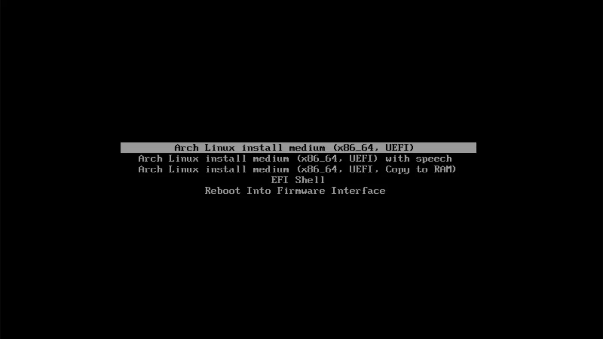
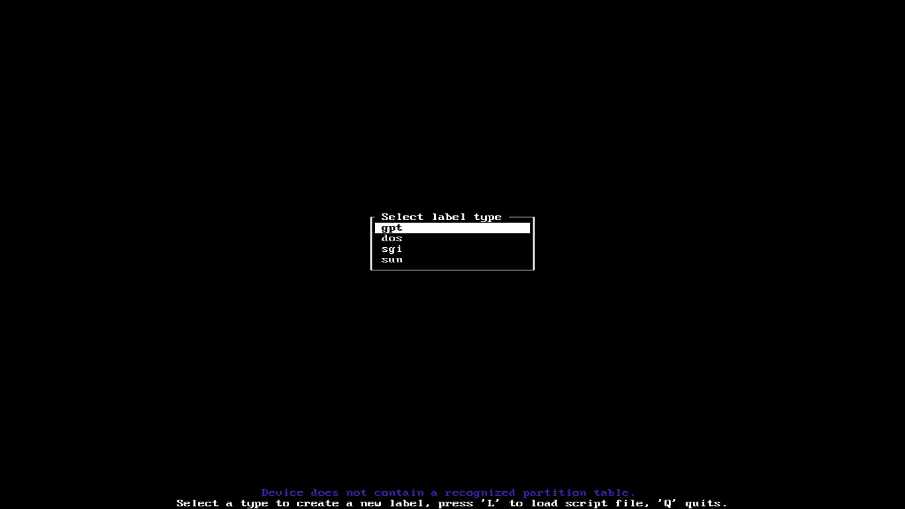
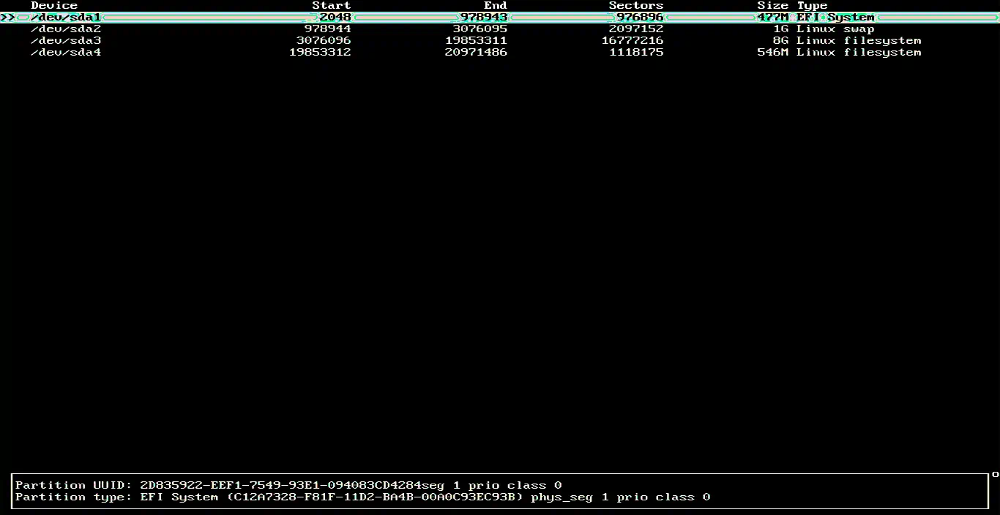
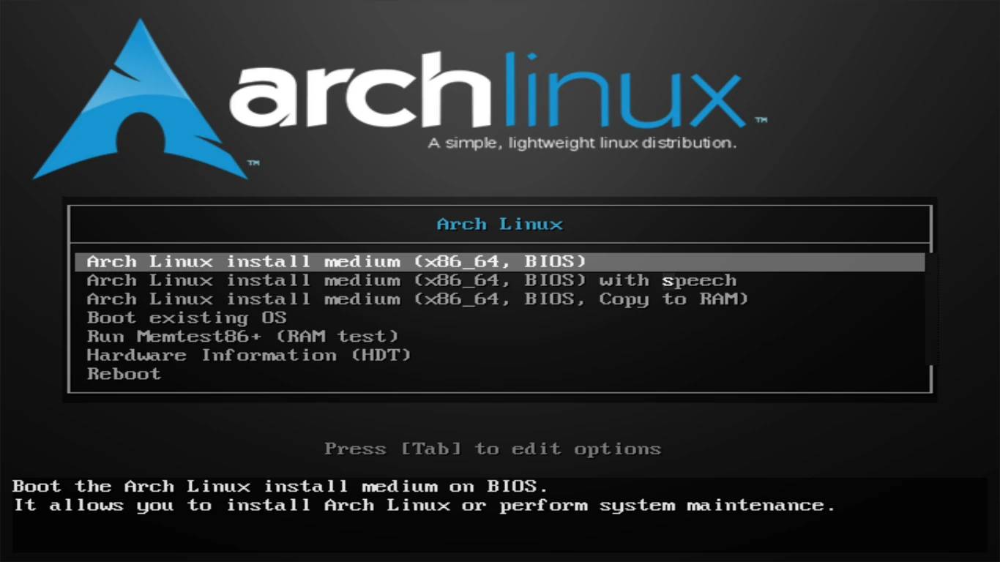
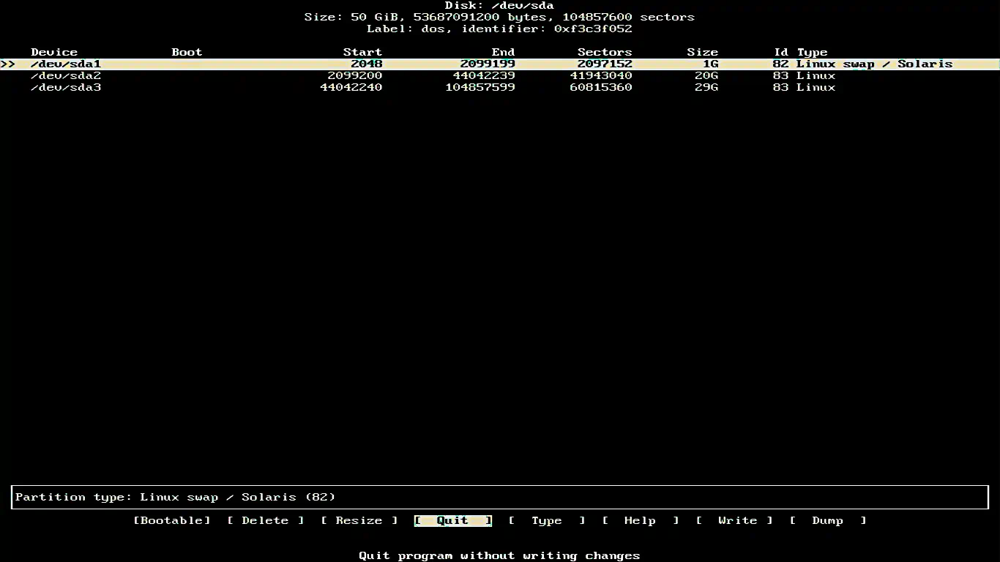

# MILD - Minimal Install Linux Desktop

MILD is a simple and straightforward text-mode installer that aims to install a "D.E."(Desktop Environment) with only the apps really necessary for each graphical environment. See below how to install in your favorite distro:

## ArchLinux

[Download](https://archlinux.org/download/) from the ArchLinux iso, then create a bootable flash drive and configure the BIOS to boot from the flash drive. Now follow the tutorial according to your PC:

## Install ArchLinux on UEFI

Now on this screen select the option "Arch Linux install medium (x86_64,UEFI)", to install ArchLinux on your PC:

Now type the following command to configure the keyboard layout if it is wrong:

	loadkeys br-abnt2

Then type this command to list all disks plugged into the PC. With the unit name in hand, go to the next step:

	fdisk -l

Now partition the disk you got in the previous command with the following command. **Attention we are not responsible for any loss of data. We recommend that before partitioning the disk you backup your data**:

	cfdisk /dev/sda

On this screen select the **GPT** partition scheme:

As your PC's BIOS is **UEFI**, create the following partitions, after you have created these partitions, click **write** and then **quit**:

Order | Type | Size
------|------|------
  1°  | EFI  | 500MB
  2°  | Swap | The size of your ram.
  3°  | Root | 50GB
  4°  | Home | Everything else.

Now format the **EFI** partition with the following command:

	mkfs.vfat /dev/sda1

Also format the **SWAP** partition with the following command:

	mkswap /dev/sda2 -L "SWAP" -f

Now format the **ROOT** partition with the following command:

	mkfs.xfs /dev/sda3 -L "ROOT" -f

Finally format the **HOME** partition with the following command:

	mkfs.xfs /dev/sda4 -L "HOME" -f

Now mount the **ROOT** partition on /mnt with the command:

	mount /dev/sda3 /mnt

Create now create the directories **/home/** and **/boot/efi/** with the command:

	mkdir -p /mnt/home/ && mkdir -p /mnt/boot/efi/

Now mount the **/mnt/boot/efi/** directory on the **EFI** partition with the command:

	mount /dev/sda1 /mnt/boot/efi

Now mount the **/home** directory on the **HOME** partition with the command:

	mount /dev/sda4 /mnt/home

Now enable the swap partition with the command:

	swapon /dev/sda2

Now download the basic packages like: Kernel, NetworkManager, Grub... with the command:

	pacstrap /mnt nano git base base-devel linux-zen linux-firmware dosfstools os-prober mtools network-manager-applet networkmanager wpa_supplicant wireless_tools dialog sudo grub-efi-x86_64 efibootmgr

Now generate the fstab table that tells the system where each partition is mounted:

	genfstab -U -p /mnt >> /mnt/etc/fstab

Now log into your system:

	arch-chroot /mnt

Change the system date and time with the time zone closest to you in my case São Paulo is the time zone closest to where I am:

	ln -sf /usr/share/zoneinfo/America/Sao_Paulo /etc/localtime

Synchronize system time with **BIOS**:

	hwclock --systohc

Now uncomment in the file "/etc/locale.gen" the language that will be used in the system:

	nano /etc/locale.gen

Enter this command to generate the locale:

	locale-gen

Now send some environment variables to the "vconsole.conf" and "/etc/locale.conf" files:

	echo LANG=pt_BR.UTF-8 >> /etc/locale.conf && echo KEYMAP=br-abnt2 >> /etc/vconsole.conf

Send a variable containing the name of your PC on the network to the "/etc/hostname" file. Replace mycomputername with whatever name you want:

	echo "mycomputername" >> /etc/hostname

Now edit the "/etc/hosts" file and add the following lines inside the file. Replace mycomputername with whatever name you want:

	127.0.0.1	localhost.localdomain	localhost
	::1	localhost.localdomain	localhost
	127.0.1.1	mycomputername.localdomain	mycomputername

Now set the **root** user password:

	passwd

Add your username now. Replace "user" with the desired username: 

	useradd -m -g users -G wheel user

Now set your user password. Replace "user" with the username created above:

	passwd user

Now add your user to the sudo group in the "/etc/sudoers" file removing all the lines and putting only these. Replace "user" with your username:

	root ALL=(ALL:ALL) ALL
	user ALL=(ALL:ALL) ALL
	@includedir /etc/sudoers.d

Now install grub on your PC with the command:

	grub-install --target=x86_64-efi --efi-directory=/boot/efi --bootloader-id=arch_grub --recheck

After this command type this:

	cp /usr/share/locale/en@quot/LC_MESSAGES/grub.mo /boot/grub/locale/en.mo

And finally this command:

	grub-mkconfig -o /boot/grub/grub.cfg

Now type **exit** and then **reboot**.

## Install ArchLinux on Legacy

Now on this screen select the option "Arch Linux install medium (x86_64,BIOS)", to install ArchLinux on your PC:

Now type the following command to configure the keyboard layout if it is wrong:

	loadkeys br-abnt2

Then type this command to list all disks plugged into the PC. With the unit name in hand, go to the next step:

	fdisk -l

Now partition the disk you got in the previous command with the following command. **Attention we are not responsible for any loss of data. We recommend that before partitioning the disk you backup your data**:

	cfdisk /dev/sda

On this screen select the **DOS** partition scheme:

As your PC's BIOS is **Legacy** create the following partitions, after you have created these partitions click **write** and then **quit**:

Order | Type | Size
------|------|------
  1°  | Swap | The size of your ram.
  2°  | Root | 50GB
  3°  | Home | Everything else.

Also format the **SWAP** partition with the following command:

	mkswap /dev/sda1 -L "SWAP" -f

Now format the **ROOT** partition with the following command:

	mkfs.xfs /dev/sda2 -L "ROOT" -f

Finally format the **HOME** partition with the following command:

	mkfs.xfs /dev/sda3 -L "HOME" -f

Now mount the **ROOT** partition on /mnt with the command:

	mount /dev/sda2 /mnt

Create now create the directories **/home** and **/boot** with the command:

	mkdir -p /mnt/home/ && mkdir -p /mnt/boot/

Now mount the **/home** directory on the **HOME** partition with the command:

	mount /dev/sda3 /mnt/home

Now enable the swap partition with the command:

	swapon /dev/sda1

Now download the basic packages like: Kernel, NetworkManager, Grub... with the command:

	pacstrap /mnt nano git base base-devel linux-zen linux-firmware dosfstools os-prober mtools network-manager-applet networkmanager wpa_supplicant wireless_tools dialog sudo grub

Now generate the fstab table that tells the system where each partition is mounted:

	genfstab -U -p /mnt >> /mnt/etc/fstab

Now log into your system:

	arch-chroot /mnt

Change the system date and time with the time zone closest to you in my case São Paulo is the time zone closest to where I am:

	ln -sf /usr/share/zoneinfo/America/Sao_Paulo /etc/localtime

Synchronize system time with **BIOS**:

	hwclock --systohc

Now uncomment in the file "/etc/locale.gen" the language that will be used in the system:

	nano /etc/locale.gen

Now send some environment variables to the files "vconsole.conf" and "/etc/locale.conf":

	echo LANG=pt_BR.UTF-8 >> /etc/locale.conf && echo KEYMAP=br-abnt2 >> /etc/vconsole.conf

Send a variable containing the name of your PC on the network to the "/etc/hostname" file. Replace mycomputername with whatever name you want:

	echo "mycomputername" >> /etc/hostname

Now edit the "/etc/hosts" file and add the following lines inside the file. Replace mycomputername with whatever name you want:

	127.0.0.1	localhost.localdomain	localhost
	::1	localhost.localdomain	localhost
	127.0.1.1	mycomputername.localdomain	mycomputername

Now set the **root** user password:

	passwd

Create your user now. Replace "user" with the desired username:

	useradd -m -g users -G wheel user

Now set your user password. Replace "user" with the username you created above:

	passwd user

Now add your user to the sudo group in the "/etc/sudoers" file removing all the lines and putting only these. Replace "user" with your username:

	root ALL=(ALL:ALL) ALL
	user ALL=(ALL:ALL) ALL
	@includedir /etc/sudoers.d

Now install grub on your PC with the command:

	grub-install --target=i386-pc --recheck /dev/sda --force

And right after this command:

	cp /usr/share/locale/en@quot/LC_MESSAGES/grub.mo /boot/grub/locale/en.mo

And finally this command:

	grub-mkconfig -o /boot/grub/grub.cfg

Now type **exit** and then **reboot**.

## Install Mild on ArchLinux

First of all, start NetworkManager so that it is possible to access the internet via cable:

	systemctl enable NetworkManager -f

Now test if your connection is working. To exit press `Ctrl` + `C`:

	ping google.com

If you are installing Mild over another GUI, press `Ctrl` + `Alt` + `F4` before continuing:

### Make ( not necessary )

First update and install the following packages on your system:

	sudo pacman -Syu git curl base-devel --noconfirm && curl --proto '=https' --tlsv1.2 -sSf https://sh.rustup.rs | sh && source $HOME/.cargo/env

Now clone this repository with the command:

	git clone https://www.github.com/PEDROTUBER44/Mild.git

Now enter the Mild/ folder with the command:

	cd Mild/

Now give execute permission to the files "build.sh" and "install.sh" with the command:

	chmod +x install.sh build.sh

Now run the "build.sh" and "install.sh" files with the command:

	./build.sh && sudo ./install.sh

Now all that's left is to install your favorite desktop environment.

### Uninstall

To uninstall Mild and all its build dependencies type the following command. It will ask if you are sure you want to uninstall Rust so click 'Y' and hit 'enter':

	sudo pacman -Rsn curl git base-devel --noconfirm && sudo rm -r /usr/bin/mild && rustup self uninstall && cd .. && rm -rf Mild/

## Non-make ( recommended )

First update and install the following packages on your system:

	sudo pacman -Syu git --noconfirm

Now clone this repository with the command:

	git clone https://www.github.com/PEDROTUBER44/Mild.git

Now enter the Mild/ folder with the command:

	cd Mild/

Now give execute permission to the "install.sh" file with the command:

	chmod +x install.sh

Now run the "install.sh" files with the command:

	sudo ./install.sh

Now all that's left is to install your favorite desktop environment.

### Uninstall

To uninstall Mild and git type the following command:

	sudo pacman -Rsn git --noconfirm && sudo rm -r /usr/bin/mild && cd .. && rm -rf Mild/

## ArchLinux Desktops Environments

Now choose the graphical environment that will be installed on your PC:

### Lxde

	mild --install-arch-lxde

### Lxqt

	mild --install-arch-lxqt

### Xfce4

	mild --install-arch-xfce

### Gnome

	mild --install-arch-gnome

### Mate

	mild --install-arch-mate

### Kde plasma

	mild --install-arch-kdeplasma

### Cinnamon

	mild --install-arch-cinnamon

### BSPWM

	mild --install-arch-bspwm

### Cutefish Desktop

	mild --install-arch-cutefish

### Clean ArchLinux Desktop

	mild --clean-arch

After that you will have a clean desktop environment with no redundant apps on your **Arch Linux !**

****

## Debian 11

First do [download](https://www.debian.org/CD/netinst/) from the iso, then create a bootable flash drive, now configure your BIOS to boot from the flash drive. After that you will see this screen and on it you should select "Graphical Install", to install Debian 11:

Now select the system language and continue the installation:

Now select the country where you live:

Now choose your keyboard layout and variant:

Now choose the name your pc will have on the network:

On this screen, click "continue":

Now enter the root user password that will be created:

Now enter your first and second name:

Now type only the first lowercase name that will be used in your "/home":

Now enter the password of this user that will be created:

Select time zone:

Now partition your disk according to your BIOS:

On **UEFI** systems create the following partitions and then click "Continue":

Order | Type | Size
------|------|------
  1°  | EFI  | 500MB
  2°  | SWAP | The size of your ram
  3°  | ROOT | 50GB
  4°  | HOME | Everything else.

On **Legacy** systems create the following partitions and then click "Continue":

Order | Type | Size
------|------|------
  1°  | SWAP | The size of your ram.
  2°  | ROOT | 50GB
  3°  | HOME | Everything else.

When you are done click on "Finish partitioning and write changes to disk":

Now check the "Yes" box and click `Enter`:

Now wait for the system base installation to finish:

Check the "No" box and click `Enter`:

Now choose the mirror closest to you and press `Enter`:

Here leave empty and click "Continue":

Select "No" and click `Enter`:

Check only this box and click "Continue":

Wait now for the installation of the Debian 11 Core:

On this screen, select the "Yes" box and click "Continue":

Now select the disk where grub will be installed and click "Continue":

Now click on continue and remove the flash drive or installation media and follow the next steps:

****

### Pós instalação

First of all log in as **root** update your system and install nano, git and sudo and edit the file "/etc/sudoers" with the following command. And add your user to the sudo group:

	apt install nano git sudo && nano /etc/sudoers

After editing the file, type the following command:

	reboot

And when the system restarts, log in with your user that you added to the sudo group. Click `Ctrl` + `Alt` + `F4` and choose the desired option:

## Make ( not necessary )

First update and install the build dependencies on your system with the following commands:

	sudo apt update -y && sudo apt upgrade -y && sudo apt install git curl build-essential -y && curl --proto '=https' --tlsv1.2 -sSf https://sh.rustup.rs | sh && source $HOME/.cargo/env

Now clone this repository with the command:

	git clone https://www.github.com/PEDROTUBER44/Mild.git

Now enter the Mild/ folder with the command:

	cd Mild/

Now give execute permission to the files "build.sh" and "install.sh" with the command:

	chmod +x install.sh build.sh

Now run the "build.sh" and "install.sh" files with the command:

	./build.sh && sudo ./install.sh

Now all that's left is to install your favorite desktop environment.

### Uninstall

To uninstall Mild and all its build dependencies type the following command. It will ask if you are sure you want to uninstall Rust so click 'Y' and hit 'enter':

	sudo apt remove curl git build-essential -y && sudo apt autoremove -y && sudo rm -r /usr/bin/mild && rustup self uninstall && cd .. && rm -rf Mild/

## Non-make ( recommended )

First update and install the following packages on your system with this command:

	sudo apt update -y && sudo apt upgrade -y && sudo apt install git -y

Now clone this repository with the command:

	git clone https://www.github.com/PEDROTUBER44/Mild.git

Now enter the Mild/ folder with the command:

	cd Mild/

Now give execute permission to the "install.sh" file with the command:

	chmod +x install.sh

Now run the "install.sh" file with the command:

	sudo ./install.sh

Now all that's left is to install your favorite desktop environment.

### Uninstall

To uninstall Mild and git type the following command:

	sudo apt remove git -y && sudo rm -r /usr/bin/mild && cd .. && rm -rf Mild/

## Debian 11 Desktops Environments

Now choose the graphical environment that will be installed on your PC:

### Lxde

	mild --install-debian-lxde

### Lxqt

	mild --install-debian-lxqt

### Xfce4

	mild --install-debian-xfce

### Gnome

	mild --install-debian-gnome

### Mate

	mild --install-debian-mate

### Kde plasma

	mild --install-debian-kdeplasma

### Cinnamon

	mild --install-debian-cinnamon

### BSPWM

	mild --install-debian-bspwm

### Cutefish

	mild --install-debian-cutefish

### Clean Debian 11 Desktop

	mild --clean-debian

After that you will have a clean desktop environment with no redundant apps on your **Debian 11 !**

****

## Fedora 35

First do [download](https://alt.fedoraproject.org/) of fedora 35 netinstall, then create a bootable USB stick with the iso and configure the BIOS to boot from the USB stick. After that you will see this screen and on it click on "Test this media & install Fedora 35", to check if the USB stick is corrupt and install fedora 35 netinstall:

Now select your language and click "Continue":

After that you will see this screen in it click on "Installation Destination", and then select the disk that will be installed fedora and also partitioned soon after, **Attention we are not responsible for any data loss. We recommend that before partitioning the disk you backup your data**:

On this screen select the disk and the box "Advanced Custom (Blivet GUI)" and click "Done":

Now on the disk partitioning screen, create the following partitions according to your BIOS:

On **UEFI** systems create the following partitions and click "Done":

Order | Type | Size
------|------|------
  1°  | EFI  | 500MB
  2°  | SWAP | The size of your ram.
  3°  | ROOT | 50GB
  4°  | HOME | Everything else.

On **Legacy** systems create the following partitions and click "Done":

Order | Type | Size
------|------|------
  1°  | SWAP | The size of your ram.
  2°  | ROOT | 50GB
  3°  | HOME | Everything else.

Soon after, you will return to this screen, where you can edit the name of your PC by clicking on "Network & Host name" and also connect to the wifi if you still don't have an internet connection and finally click on "Done":

After that click on "Software Selection" and only check "Minimum install" as in the image below and if you want to use wifi, also check "Common NetworkManager Submodules" and click "Done":

Now on the home screen click on "Root Account" to set a password for the root user, now check the box "Enable root account" and enter the password and click on "Done":

Now on the home screen again click on "User Creation" and fill in what is requested and finally click on "Done":

With everything finished click on "Begin Installation" and wait for the installation to finish:

Now click on "Reboot System" and remove the USB flash drive or installation media from the PC and follow the next steps:

### Pós instalação

First of all log in as **root** update your system and install nano, git and sudo and edit the file "/etc/sudoers" with the following command. And add your user to the sudo group:

	dnf updade -y && dnf install nano git -y && nano /etc/sudoers

After editing the file, type the following command:

	reboot

And when the system restarts, log in with your user that you added to the sudo group. Click `Ctrl` + `Alt` + `F4` and choose the desired option:

### Make ( Não é necessario )

First update and install the build dependencies on your system with the following commands:

	sudo dnf update -y && sudo dnf install curl git -y && curl --proto '=https' --tlsv1.2 -sSf https://sh.rustup.rs | sh && source $HOME/.cargo/env

Now clone this repository with the command:

	git clone https://www.github.com/PEDROTUBER44/Mild.git

Now enter the Mild/ folder with the command:

	cd Mild/

Now give execute permission to the files "build.sh" and "install.sh" with the command:

	sudo chmod +x install.sh build.sh

Now run the "build.sh" and "install.sh" files with the command:

	./build.sh && sudo ./install.sh

Now all that's left is to install your favorite desktop environment.

### Uninstall

	sudo dnf remove curl git -y && sudo rm -r /usr/bin/mild && rustup self uninstall && cd .. && rm -rf Mild/

## Non-make ( recommended )

First update and install git on your system with the following commands:

	sudo dnf update -y && sudo dnf install git -y

Now clone this repository with the command:

	git clone https://www.github.com/PEDROTUBER44/Mild.git

Now enter the Mild/ folder with the command:

	cd Mild/

Now give execute permission to the "install.sh" file with the command:

	sudo chmod +x install.sh

Now run the "install.sh" file with the command:

	sudo ./install.sh

Now all that's left is to install your favorite desktop environment.

### Uninstall

	sudo dnf remove git -y && sudo rm -r /usr/bin/mild && cd .. && rm -rf Mild/

## Fedora 35 Desktops Environments

Now choose the graphical environment that will be installed on your PC:

### Lxde

	mild --install-fedora-lxde

### Lxqt

	mild --install-fedora-lxqt

### Xfce4

	mild --install-fedora-xfce

### Gnome

	mild --install-fedora-gnome

### Mate

	mild --install-fedora-mate

### Kde plasma

	mild --install-fedora-kdeplasma

### Cinnamon

	mild --install-fedora-cinnamon

### BSPWM

	mild --install-fedora-bspwm

### Cutefish Desktop

	mild --install-fedora-cutefish

### Clean Fedora 35 Desktop

	mild --clean-fedora

After that you will have a clean desktop environment with no redundant apps on your **Fedora 35 !**

****

MILD = Minimal Install Linux Desktop

Donate for project: PIX = 85b39c80-2a6d-4dd7-b645-c66b4b12a97b