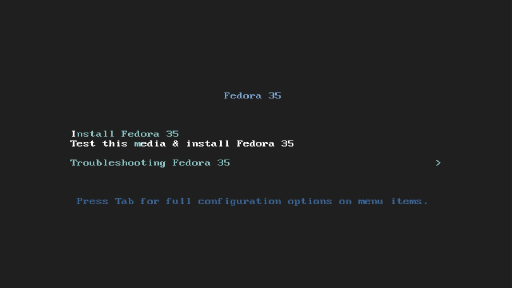
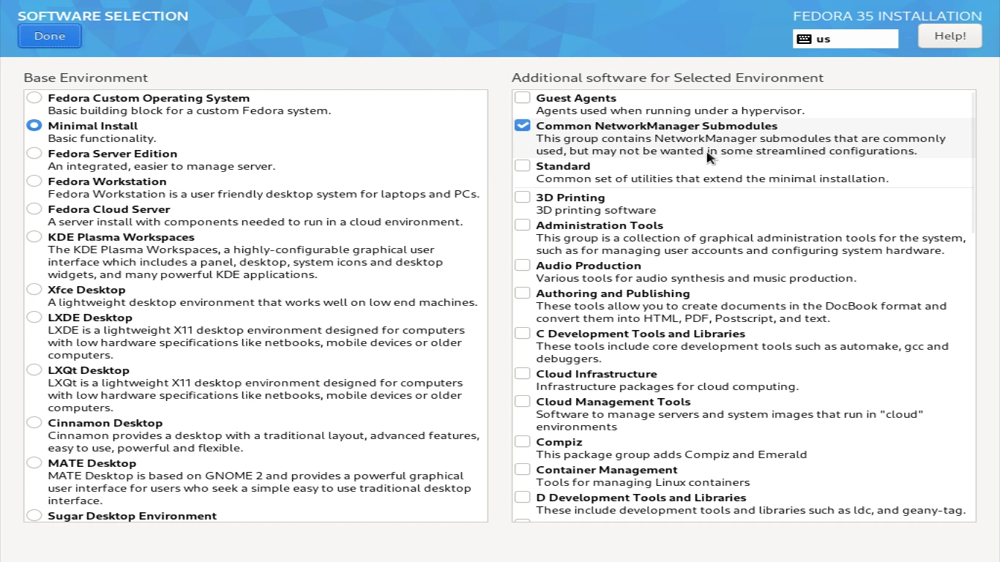
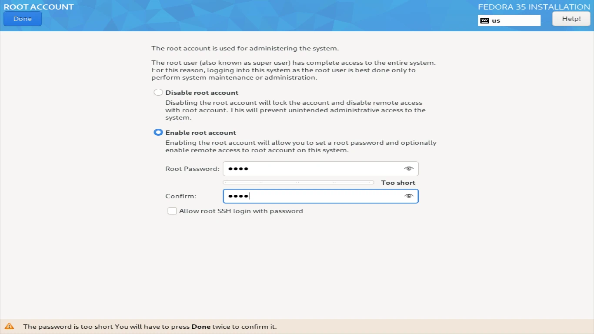

# MILD - Minimal Install Linux Desktop
MILD is a simple and straightforward text-mode installer that aims to install a "D.E."(Desktop Environment) with only the apps really necessary for each graphical environment. See below how to install in your favorite distro:

## Arch Linux
First download Arch Linux iso from the official website, after that make a bootable pendrive, with Arch Linux iso and configure in BIOS, to boot from pendrive. After that you will see this screen and on it you should select "Arch Linux install medium (x86_64,BIOS)", to install Arch Linux:

First click ‘Ctrl’ + ‘Alt’ + ‘F2’ login as **root** enter the password and proceed:

Now install Arch Linux as you normally do, but when you install the graphical interface clone this repository, now choose whether or not you want to compile mild on your pc:

### Make (not necessary)
First update your system:

	pacman -Syu --noconfirm

Now install the rust, curl and git compiler:
After that rust will ask if you want to install rustup so click 1 and hit enter:

	pacman -Sy git curl base-devel --noconfirm && curl --proto '=https' --tlsv1.2 -sSf https://sh.rustup.rs | sh

Clone the repository with the following command:

	git clone https://www.github.com/PEDROTUBER44/Mild.git

Now enter the project folder

	cd Mild/

Give the "build.sh" file execute permission:

	chmod +x build.sh

Give the "install.sh" file execute permission:

	chmod +x install.sh

After that reboot the system, log in as root and enter the project folder and type the following commands to compile and install mild:

	./build.sh && ./install.sh

Now all that's left is to install your favorite D.E.

### Uninstall
To uninstall mild and its dependencies type the following command, it will ask you if you are sure you want to uninstall rust so click "s" and hit enter:

	pacman -Rsn curl git base-devel -y && rm -r /bin/mild && rustup self uninstall && cd .. && rm -rf Mild/

## Non-make ( recommended )
First update your system:

	pacman -Syu --noconfirm

Now install the git:

	pacman -Sy git -y

Clone the repository with the following command:

	git clone https://www.github.com/PEDROTUBER44/Mild.git

Now enter the project folder

	cd Mild/

Give the "install.sh" file execute permission:

	chmod +x install.sh

Finally run the "install.sh" file:

	./install.sh

### Uninstall

	pacman -Rsn git -y && cd .. && rm -rf Mild/ && rm -r /bin/mild 

Now all that's left is to install your favorite D.E.

## Desktops ArchLinux
Now choose which graphical environment will be installed on your PC:

### Lxde

	mild --install-arch-lxde

### Lxqt

	mild --install-arch-lxqt

### Xfce4

	mild --install-arch-xfce

### Gnome

	mild --install-arch-gnome

### Mate

	mild --install-arch-mate

### Kde plasma

	mild --install-arch-kdeplasma

### Cinnamon

	mild --install-arch-cinnamon

### BSPWM

	mild --install-arch-bspwm

### Cutefish Desktop

	mild --install-arch-cutefish

### Clean ArchLinux Desktop

	mild --clean-arch

After that you will have a clean desktop environment with no redundant apps on your **Arch Linux !**

****

## Debian 11
First download Debian 11 iso netinstall from the official website, after that make a bootable pendrive, with Debian 11 iso netinstall and configure in BIOS, to boot from pendrive. After that you will see this screen and on it you should select "Graphical Install", to install Debian 11:

Now select your language to continue the installation:

Now choose the place where you live:

Now choose the keyboard layout and its variant:

Write the name your pc will have on the network:

On this screen click "continue":

Now enter the root user password:

Now enter the full name of the user that will be created for you:

Now choose the username that will be used in your "/home/user":

Now set the password for this user you just created:

Select time zone now:

Now partition your disk according to your bios:

On **UEFI** systems make the following partitions (Remembering that the order does not matter) and then click "Done":

Order | Type | Size
------|------|--------
  1°  | efi  | 500MB  
  2°  | swap | The size of your ram.
  3°  | root | 70GB   
  4°  | home | Everything else.

On **Legacy** systems make the following partitions (Remembering that the order does not matter) and then click "Done":

Order | Type | Size
------|------|--------  
  1°  | swap | The size of your ram.
  2°  | root | 70GB   
  3°  | home | Everything else.

With everything finished click on "Finish partitioning and white changes to disk":

Now check the box "Yes" and click enter:

Now wait for the base installation to finish:

Check the box "No" and press enter:

Now choose a mirror near you to install packages as quickly as possible:

Now leave it blank and click "Continue":

Select "No" and hit enter:

Check only this box and click "continue":

Now wait to install debian 11 core:

On this screen select "Yes" and click on "continue":

Now choose where grub will be installed and click continue:

And end now click continue and remove the pendrive or installation media and follow the next steps:

****

### Post installation
First click ‘Ctrl’ + ‘Alt’ + ‘F2’ login as **root** enter the password and proceed:

Now choose if you want to compile the app and install it on your machine or just install it:

### Make (not necessary)
First update your system:

	apt update -y && apt upgrade -y

Now install the rust, curl and git compiler:
After that rust will ask if you want to install rustup so click 1 and hit enter:

	apt install git curl build-essential -y && curl --proto '=https' --tlsv1.2 -sSf https://sh.rustup.rs | sh

Clone the repository with the following command:

	git clone https://www.github.com/PEDROTUBER44/Mild.git

Now enter the project folder

	cd Mild/

Give the "build.sh" file execute permission:

	chmod +x build.sh

Give the "install.sh" file execute permission:

	chmod +x install.sh

After that reboot the system, log in as root and enter the project folder and type the following commands to compile and install mild:

	./build.sh && ./install.sh

Now all that's left is to install your favorite D.E.

### Uninstall
To uninstall mild and its dependencies type the following command, it will ask you if you are sure you want to uninstall rust so click "s" and hit enter:

	apt remove curl git build-essential -y && rm -r /bin/mild && rustup self uninstall && cd .. && rm -rf Mild/

## Non-make ( recommended )
First update your system:

	apt update -y && apt upgrade -y

Now install the git:

	apt install git -y

Clone the repository with the following command:

	git clone https://www.github.com/PEDROTUBER44/Mild.git

Now enter the project folder

	cd Mild/

Give the "install.sh" file execute permission:

	chmod +x install.sh

Finally run the "install.sh" file:

	./install.sh

### Uninstall

	apt remove git -y && cd .. && rm -rf Mild/ && rm -r /bin/mild 

Now all that's left is to install your favorite D.E.

## Desktops Debian 11
Now choose which graphical environment will be installed on your PC:

### Lxde

	mild --install-debian-lxde

### Lxqt

	mild --install-debian-lxqt

### Xfce4

	mild --install-debian-xfce

### Gnome

	mild --install-debian-gnome

### Mate

	mild --install-debian-mate

### Kde plasma

	mild --install-debian-kdeplasma

### Cinnamon

	mild --install-debian-cinnamon

### BSPWM

	mild --install-debian-bspwm

### Cutefish Desktop

	mild --install-debian-cutefish

### Clean Debian 11 Desktop

	mild --clean-debian

After that you will have a clean desktop environment with no redundant apps on your **Debian 11 !**

****

## Fedora 35
First download fedora 35 iso netinstall from the official website, after that make a bootable pendrive, with fedora 34 iso netinstall and configure in BIOS, to boot from pendrive. After that you will see this screen and on it you should select "Test this media & install Fedora 34", to check if the iso on the pendrive is corrupted and install Fedora 34:

After that you will see this screen and on it select your language, and after that click on continue:

After that you will see the screen below and on it select "Installation destination", and then select the disk that will be installed as well as partitioned for the installation of Fedora 35, **Attention we are not responsible for any data loss**, and we recommend to back up your data on a separate drive and preferably disconnected from your pc at least during installation.

After that select the disk and click on "Advanced Custom (Blivet GUI)" and click "Done":

Then the disk partitioning screen will open, and in it create the following partitions:

On **UEFI** systems make the following partitions (Remembering that the order does not matter) and then click "Done":

Order | Type | Size
------|------|--------
  1°  | efi  | 500MB  
  2°  | swap | The size of your ram.
  3°  | root | 70GB   
  4°  | home | Everything else.

On **Legacy** systems make the following partitions (Remembering that the order does not matter) and then click "Done":

Order | Type | Size
------|------|--------  
  1°  | swap | The size of your ram.
  2°  | root | 70GB   
  3°  | home | Everything else.

Then you will return to this screen, where you can edit your pc's network name by clicking "Network & Host name" and also connect to wifi.

After these settings click on "Software Selection" and just check "Minimum install" like the image below and if you want to use wifi, check also "Common NetworkManager Submodules":

After that click on "Root Account" to set the root user password, now select the box "Enable root account" and enter your password and click "Done":

After that click on "User Creation" and fill in what is being requested and click "Done":

With everything done click on "Begin Installation" and wait for the installation:

And end now click continue and remove the pendrive or installation media and follow the next steps:

### Post installation
First click ‘Ctrl’ + ‘Alt’ + ‘F2’ login as **root** enter the password and proceed:

Now choose if you want to compile the app and install it on your machine or just install it:

### Make ( not necessary )
First update your system:

	dnf update -y

Now install the rust compiler and git:

	dnf install cargo curl rust git -y

Clone the repository with the following command:

	git clone https://www.github.com/PEDROTUBER44/Mild.git

Now enter the project folder

	cd Mild/

Give the "build.sh" and "install.sh" file execute permission:

	chmod +x build.sh && chmod +x install.sh

Finally run the "build.sh" and "install.sh" file:

	./build.sh && ./install.sh

### Uninstall

	dnf remove cargo curl rust git -y && cd .. && rm -rf Mild/ && rm -r /bin/mild 

Now all that's left is to install your favorite D.E.

## Non-make ( recommended )
First update your system:

	dnf update -y

Now install the git:

	dnf install git -y

Clone the repository with the following command:

	git clone https://www.github.com/PEDROTUBER44/Mild.git

Now enter the project folder

	cd Mild/

Give the "install.sh" file execute permission:

	chmod +x install.sh

Finally run the "install.sh" file:

	./install.sh

### Uninstall

	dnf remove git -y && cd .. && rm -rf Mild/ && rm -r /bin/mild 

Now all that's left is to install your favorite D.E.

## Desktops Fedora 35
Now choose which graphical environment will be installed on your PC:

### Lxde

	mild --install-fedora-lxde

### Lxqt

	mild --install-fedora-lxqt

### Xfce4

	mild --install-fedora-xfce

### Gnome

	mild --install-fedora-gnome

### Mate

	mild --install-fedora-mate

### Kde plasma

	mild --install-fedora-kdeplasma

### Cinnamon

	mild --install-fedora-cinnamon

### BSPWM

	mild --install-fedora-bspwm

### Cutefish Desktop

	mild --install-fedora-cutefish

### Clean Fedora 35 Desktop

	mild --clean-fedora

After that you will have a clean desktop environment with no redundant apps on your **Fedora 35 !**

****

MILD = Minimal Install Linux Desktop

Donate for project: PIX = 85b39c80-2a6d-4dd7-b645-c66b4b12a97b