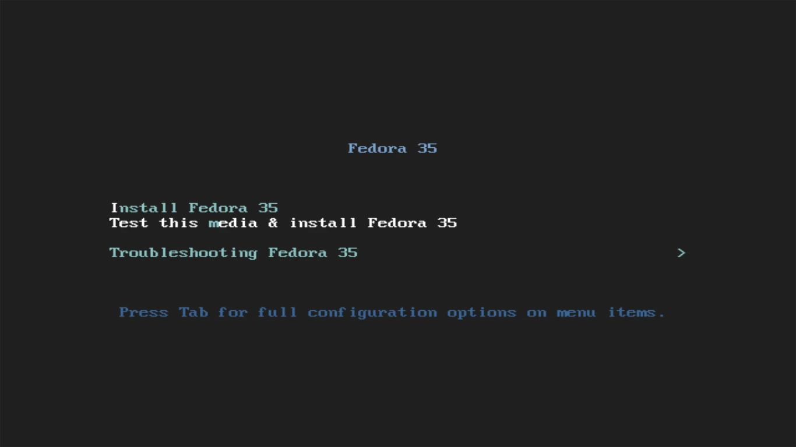
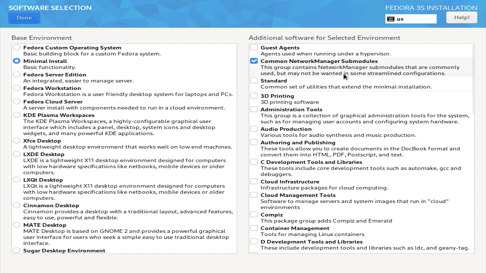
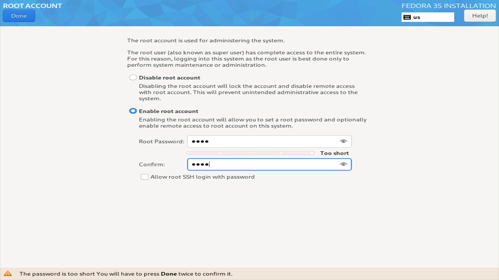

First do [download](https://alt.fedoraproject.org/) of fedora 35 netinstall, then create a bootable USB stick with the iso and configure the BIOS to boot from the USB stick. After that you will see this screen and on it click on "Test this media & install Fedora 35", to check if the USB stick is corrupt and install fedora 35 netinstall:

Now select your language and click "Continue":

After that you will see this screen in it click on "Installation Destination", and then select the disk that will be installed fedora and also partitioned soon after, **Attention we are not responsible for any data loss. We recommend that before partitioning the disk you backup your data**:

On this screen select the disk and the box "Advanced Custom (Blivet GUI)" and click "Done":

Now on the disk partitioning screen, create the following partitions according to your BIOS:

On **UEFI** systems create the following partitions and click "Done":

Order | Type | Size
------|------|------
  1°  | EFI  | 500MB
  2°  | SWAP | The size of your ram memory.
  3°  | ROOT | 50GB
  4°  | HOME | Everything else.

On **Legacy** systems create the following partitions and click "Done":

Order | Type | Size
------|------|------
  1°  | SWAP | The size of your ram memory.
  2°  | ROOT | 50GB
  3°  | HOME | Everything else.

Soon after, you will return to this screen, where you can edit the name of your PC by clicking on "Network & Host name" and also connect to the wifi if you still don't have an internet connection and finally click on "Done":

After that click on "Software Selection" and only check "Minimum install" as in the image below and if you want to use wifi, also check "Common NetworkManager Submodules" and click "Done":

Now on the home screen click on "Root Account" to set a password for the root user, now check the box "Enable root account" and enter the password and click on "Done":

Now on the home screen again click on "User Creation" and fill in what is requested and finally click on "Done":

With everything finished click on "Begin Installation" and wait for the installation to finish:

Now click on "Reboot System" and remove the USB flash drive or installation media from the PC and follow the next steps:

### Pós instalação

First of all log in as **root** update your system and install nano, git and sudo and edit the file "/etc/sudoers" with the following command. And add your user to the sudo group:

	dnf updade -y && dnf install nano git -y && nano /etc/sudoers

After editing the file, type the following command:

	reboot

And when the system restarts, log in with your user that you added to the sudo group. Click `Ctrl` + `Alt` + `F4` and choose the desired option:
